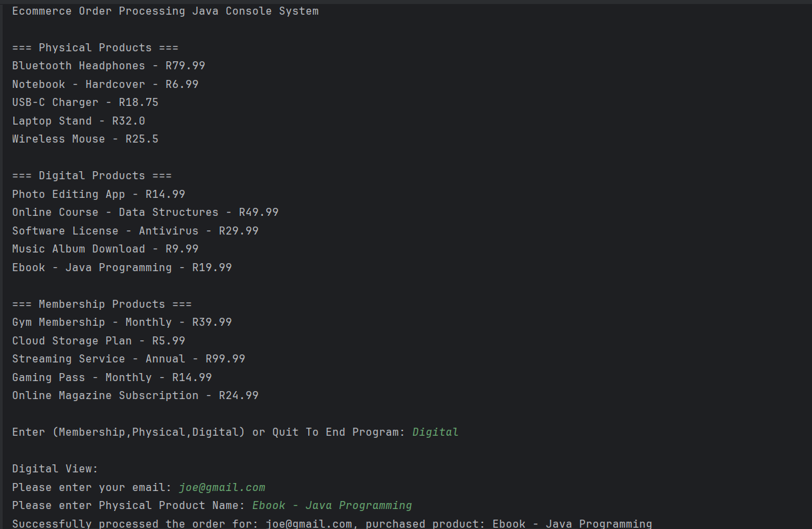

# E-commerce Order Processing System

> A Java console order processing system application, built using MVC design pattern and OOP principles to process multiple kinds of products. The goal of the application is to give the user an easy-to-use system that requires just a few inputs to get the product they desire processed.


---

## 🚀 Features

- ✅ **Multi-Type Order Handling**
  - Processes **Physical Product**, **Digital Product**, and **Membership** orders.

- 🧠 **OOP Principles Applied**
  - Implements:
    - **Abstraction** via interfaces
    - **Inheritance** via a base class
    - **Encapsulation** using private fields and public properties
    - **Polymorphism** for flexible order processing

- 🧩 **Interface-Based Design**
  - All order types implement a common `IOrder` interface, enabling consistent interaction.

- 🏗 **Reusable Base Class**
  - Shared fields like `OrderId` and `CustomerEmail` are defined once in `OrderBase`.

- 🧬 **Polymorphic Execution**
  - Calls `ProcessOrder()` on different order types through the `IOrder` interface, without knowing the exact class.

- 🖥 **Console-Based Menu Interface**
  - User-friendly, menu-driven interface allows selecting and processing orders interactively.

- 🔐 **Data Encapsulation**
  - Sensitive fields are managed using `get`/`set` properties to ensure proper data access control.

- 🧪 **Testable Architecture**
  - Designed for easy unit testing and expansion with new order types in the future.

## 📸 Screenshots



## 🛠️ Installation

```bash
# Clone the repo
git clone https://github.com/tshepangkagiso/Ecommerce-Order-Processing-Java-Console-System.git

# Navigate to the directory
cd Ecommerce-Order-Processing-Java-Console-System

# Run the application (assuming a compiled jar or via IDE)
java -jar YourApp.jar
````

*Note:* Make sure you have Java Virtual Machine (JVM) installed on your system.

## 📦 Usage

Run the console application and follow the on-screen menu prompts to process different types of orders.

## 🧱 Built With

* [Java](https://www.oracle.com/java/) - Programming language

## 🗂️ Project Structure

```
Ecommerce-Order-Processing-System/
├── idea/
├── out/
├── screenshots/
├── src/
│   ├── .gitignore
│   ├── EcommerceOrderProcessingSystem.iml
│   ├── Main/               
│   └── OrderProcessingSystem/
│       ├── Controllers/
│       │   ├── Handlers/
│       │   │   ├── DigitalProductOrderHandler/
│       │   │   ├── MembershipOrderHandler/
│       │   │   └── PhysicalProductOrderHandler/
│       │   └── Interface/
│       │       └── iOrder/
│       ├── Models/
│       │   ├── Classes/
│       │   │   ├── DigitalProductOrder/
│       │   │   ├── MembershipOrder/
│       │   │   ├── OrderBase/
│       │   │   └── PhysicalProductOrder/
│       │   └── Interfaces/
│       │       └── iOrderBase/
│       └── Views/
│           ├── Handlers/
│           │   ├── AllProductView/
│           │   ├── DigitalProductOrderView/
│           │   ├── HomeView/
│           │   ├── MembershipOrderView/
│           │   └── PhysicalProductView/
│           └── Interface/
│               └── iUserInput/
├── External Libraries/
└── Scratches and Consoles/
```

## 🧑‍💻 Contributing

Contributions are welcome! Please follow these steps:

1. Fork this repo
2. Create a new branch: `git checkout -b feature-name`
3. Make changes and commit: `git commit -m 'Add feature'`
4. Push to the branch: `git push origin feature-name`
5. Create a pull request

## 🪪 License

Distributed under the MIT License. See `LICENSE` for more information.

## 🙋‍♂️ Contact

Project Link: [https://github.com/tshepangkagiso/Ecommerce-Order-Processing-Java-Console-System.git](https://github.com/tshepangkagiso/Ecommerce-Order-Processing-Java-Console-System.git)

---

> © 2025 Tshepang Kagiso Mashigo

```

